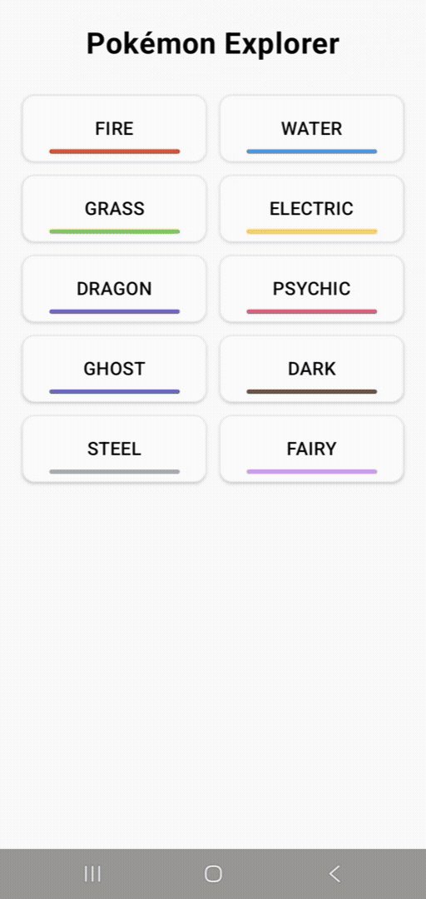
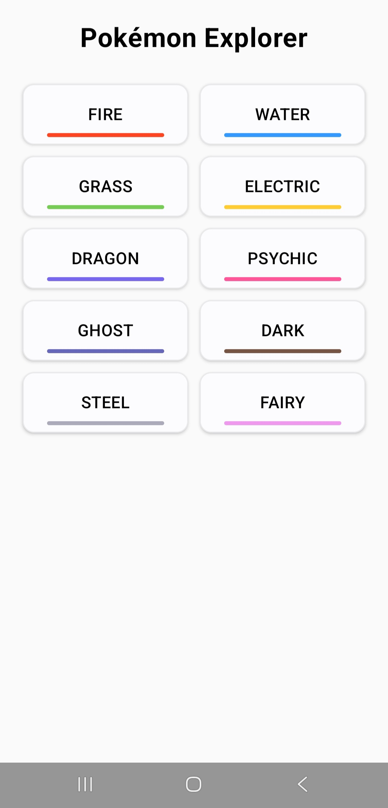
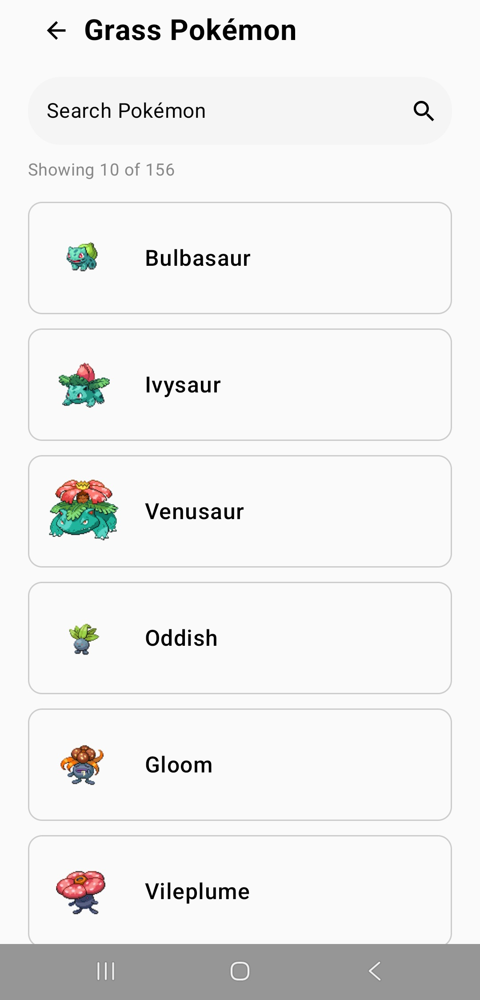
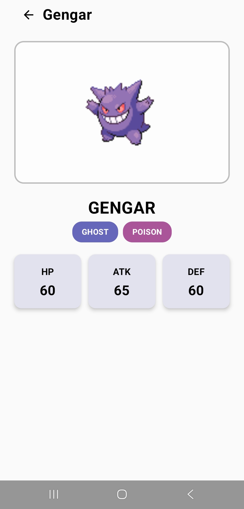
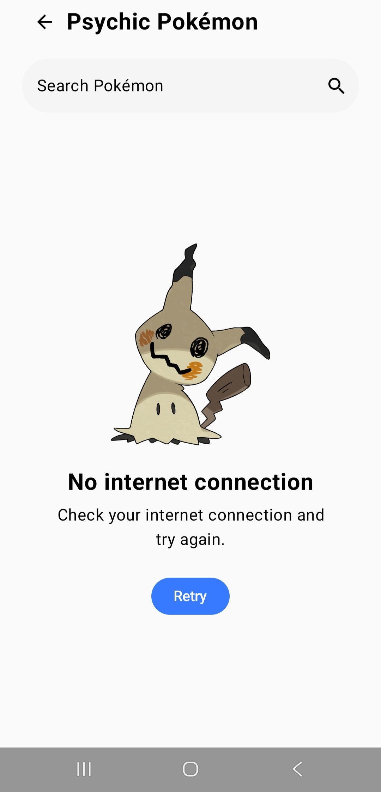
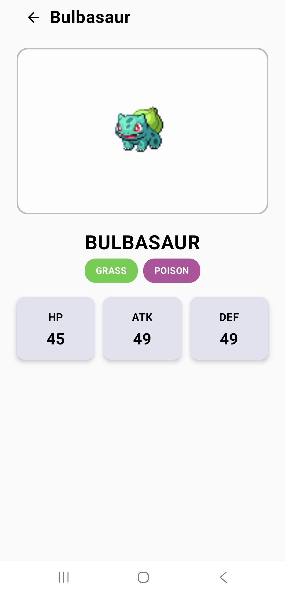
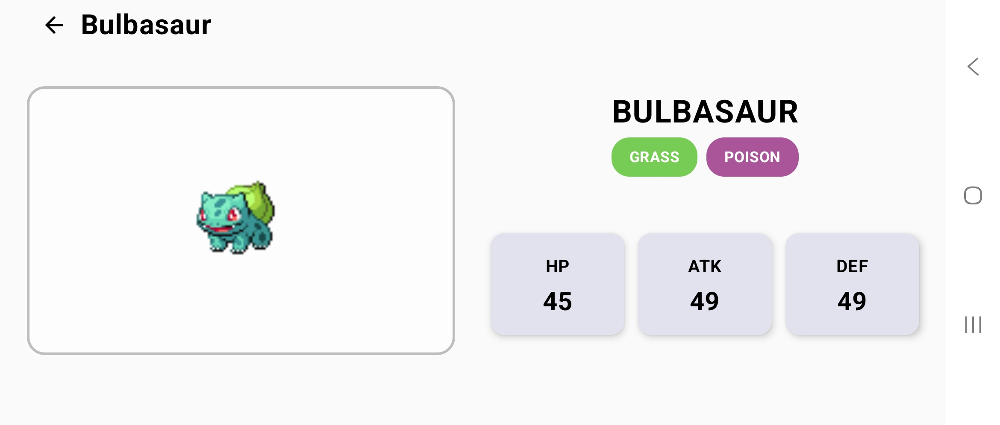

# Pokémon Explorer

Pokémon Explorer is an Android application built with Kotlin and Jetpack Compose that uses the PokéAPI to browse Pokémon by type.

The app starts with type selection. Choosing one of the ten available Pokémon types loads the Pokémon that belong to that type. Results are displayed in batches of ten, and users can search within those results by name. Each Pokémon can be opened to view its sprite, primary and secondary types, HP, Attack, and Defense.

This project was developed as part of a mobile development assignment.

## Features

- Browse Pokémon from 10 available types:  
  Fire, Water, Grass, Electric, Dragon, Psychic, Ghost, Dark, Steel, and Fairy
- Search Pokémon by name within the selected type
- Display the first 10 Pokémon and load additional results in batches
- View Pokémon details:
  - Name
  - Sprite
  - Primary and secondary types
  - HP
  - Attack
  - Defense
- Responsive layouts for portrait and landscape orientation
- Graceful handling of:
  - No internet connection
  - Request timeouts
  - API errors
  - Unexpected errors
  - Failed sprite loading
- Retry failed requests and missing Pokémon images after connectivity is restored

## Demo

The demo below shows the main app flow, from selecting a Pokémon type and filtering the results by name to viewing Pokémon details.

<p align="center">
  
</p>

---
## Screenshots

### Type Selection

Users can choose from the ten available Pokémon types directly from the home screen.

<p align="center">
  
</p>

### Results & Search

Pokémon from the selected type are displayed in batches of ten. The results can also be filtered by name.

<p align="center">
  
</p>

### Pokémon Details

Each Pokémon has a dedicated details screen showing its sprite, primary and secondary types, HP, Attack, and Defense.

<p align="center">
  
</p>

### Error Handling

Network and request failures are handled with clear error messages and retry support.

<p align="center">
  
</p>

### Responsive Layout

The Pokémon details screen adapts its layout when the device rotates between portrait and landscape orientation.
#### Portrait

<p align="center">
  
</p>

#### Landscape

<p align="center">
  
</p>

## Tech Stack

- **Language:** Kotlin
- **UI:** Jetpack Compose, Material 3
- **Architecture:** MVVM, ViewModel, Repository pattern
- **Navigation:** Navigation Compose
- **Networking:** Retrofit, Gson, PokéAPI
- **Async:** Kotlin Coroutines
- **Image Loading:** Coil

## Architecture

The app follows an **MVVM-style architecture** with a clear separation between the UI and data layers.

- **UI Layer (Jetpack Compose):** Displays the current state and forwards user interactions to the ViewModels.
- **ViewModel Layer:** Handles screen state, search, loading, retries, and incremental result loading.
- **Data Layer (Repository Pattern):** Provides Pokémon data and keeps networking concerns separate from the UI.
- **Network Layer (Retrofit):** Defines the PokéAPI requests used by the repository.

```
UI Screens
    ↓
ViewModels
    ↓
PokemonRepository
    ↓
PokeApi
    ↓
PokéAPI
```

## Implementation Notes

### Loading Pokémon in Batches

PokéAPI's type endpoint returns the full list of Pokémon that belong to a selected type rather than a paginated nested result set.

The app therefore loads the type membership once and displays the results in batches of ten. Pokémon details and sprites are then fetched only for the currently loaded batch.

### Search

Search is performed within the Pokémon of the currently selected type. Matching is case-insensitive and filters Pokémon whose names start with the entered text.

### Error Handling

The app handles common network and loading failures, including:

- No internet connection
- Request timeouts
- API errors
- Unexpected errors
- Failed Pokémon sprite loading

Failed requests on the Results and Pokémon Details screens can be retried. On the Results screen, failed or missing Pokémon sprites are automatically requested again when connectivity is restored.

## Getting Started

Clone the repository and open it in Android Studio:

```bash
git clone https://github.com/PeriklisVai/pokemon-explorer.git
```

Then sync Gradle and run the app on an emulator or physical device.

## Future Improvements

- Add persistent offline caching so Pokémon data remains available after restarting the app
- Add dark theme support
- Adapt the top bar color to the currently selected Pokémon type
- Replace the standard loading indicator with a type-specific running Pokémon animation

## API

Pokémon data is provided by the [PokéAPI](https://pokeapi.co/).
